# 🔹IntelliJ IDEA Ultimate

**IntelliJ IDEA** ya lo conocéis, porque lo habéis estado utilizando en el módulo de programación de primero, no obstante, en el **apartado de Instalación** tenéis algunas indicaciones sobre su descarga e instalación.

En el **apartado de Configuración** tenéis las indicaciones para crear cada uno de los proyectos correspondientes a cada UD de este módulo.

## 🔹Instalación

En el momento de realizar estos apuntes la última versión es la **2025**. El enlace para su descarga es **[https://www.jetbrains.com/idea/](https://www.jetbrains.com/idea/)**{.azul}.

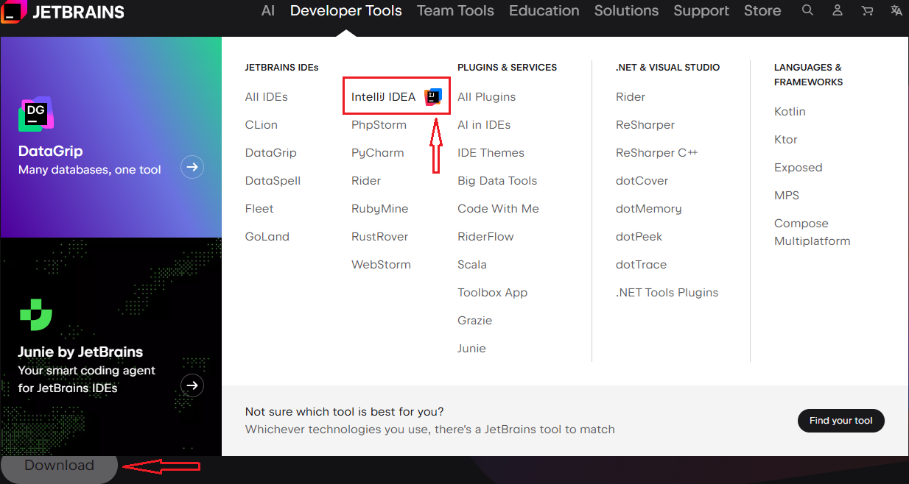|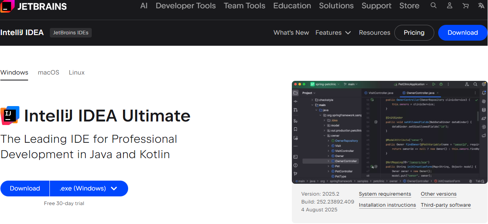
---------------------------|-----------------------------

Seleccionamos **Download** y descargamos la **versión Ultimate**, que es la que nos proporcionará todas las herramientas para poder trabajar sin problemas.

!!!Note "Licencia"
    Para obtener una licencia de **estudiante**, que elimine la restricción de una versión de prueba de 30 días, es neceasario que la solicitéis en el enlace correspondiente y rellenéis los datos del formulario:

    
    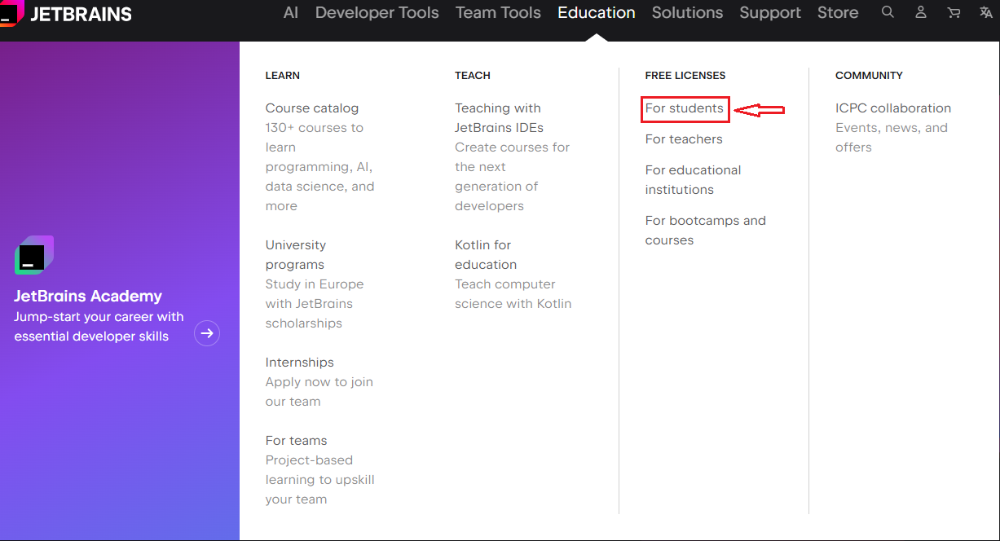|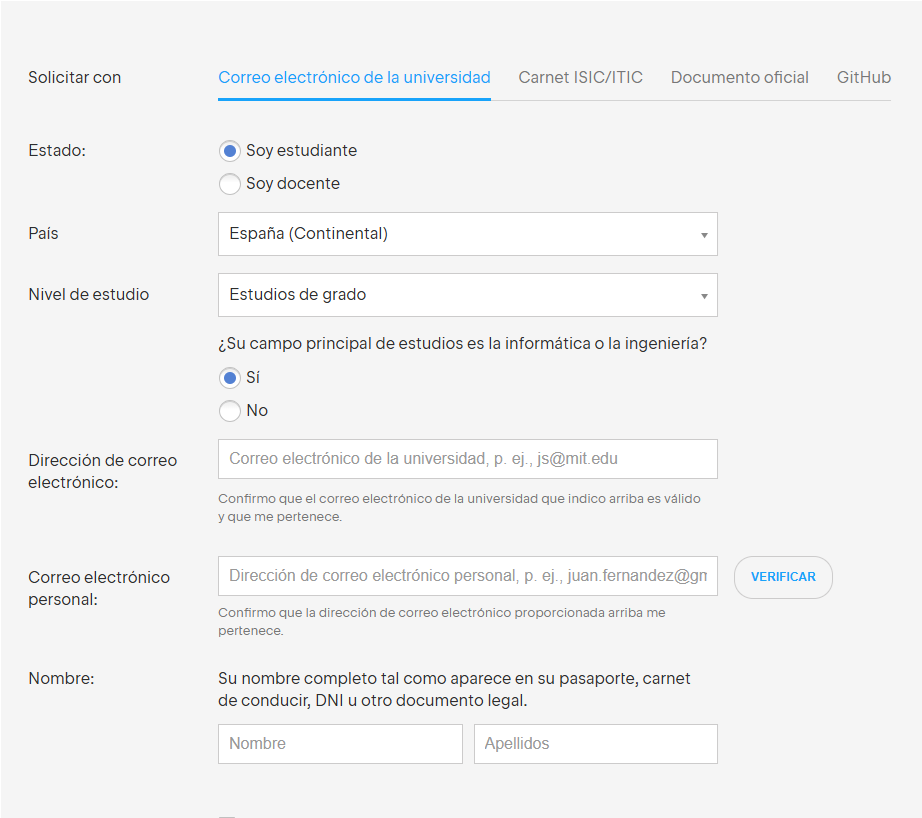
    ---------------------------|-----------------------------

## 🔹Configuración

Cuando creamos un nuevo proyecto en IntelliJ IDEA, el IDE nos ofrece diferentes configuraciones y plantillas iniciales: Java, Kotlin, proyectos con **Gradle** o **Maven**, aplicaciones Android, entre otras.

**Gradle** y **Maven** son unas herramientas de automatización de construcción de proyectos (build tool) muy utilizadas en el desarrollo de software.Se encargan de compilar, ejecutar, probar y empaquetar un proyecto, además de gestionar de forma automática las librerías externas que necesita.

En este módulo nos centraremos en estas configuraciones:

- **Kotlin** simple para ejercicios básicos.
- **Kotlin con Gradle** para manejo avanzado de ficheros y bases de datos.
- **Kotlin con Maven** y complemento **Spring** para proyectos web y APIs con Spring Boot.

|Sin Gradle|Con Gradle|
|----------|----------|
|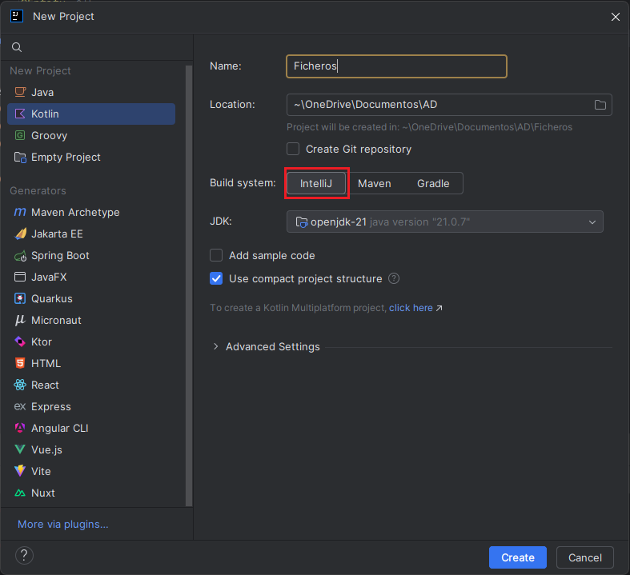|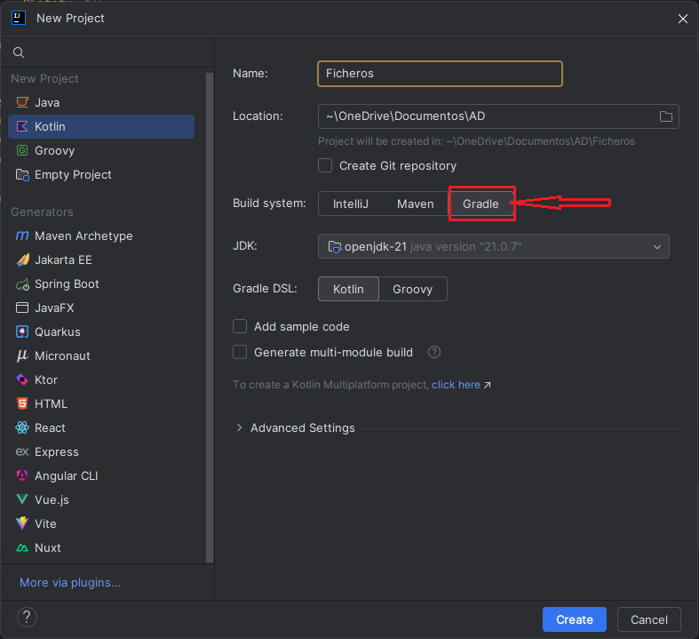|

## 🔹Proyecto nuevo

Una vez elegida la configuración del proyecto según nuestras necesidades, se genera automáticamente la estructura de carpetas donde guardaremos nuestros programas. Dentro de la carpeta **src** podemos añadir directamente los archivos Kotlin o, si lo preferimos, crear paquetes para organizar mejor el código.

|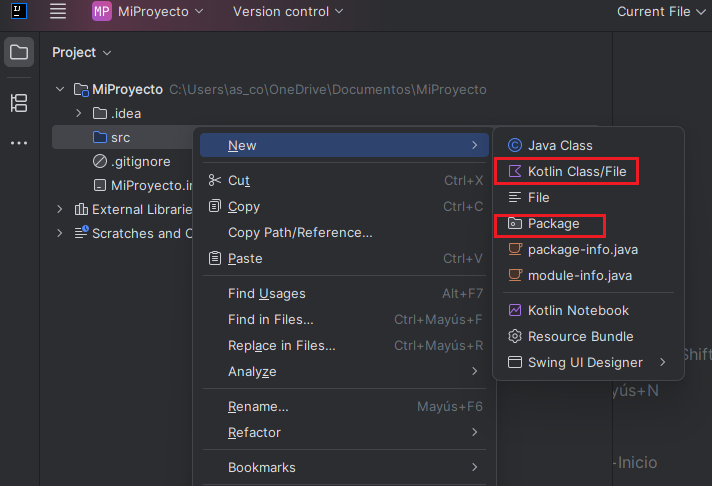|

En los proyectos creados con Gradle la estructura de carpetas varía ligeramente. Para añadir nuestros programas debemos ir a la ruta **src/main/kotlin**, mientras que en la raíz del proyecto también se genera la carpeta **resources** (destinada a archivos auxiliares como datos o configuraciones) y los ficheros de configuración propios de **Gradle**, como **build.gradle.kts**.

|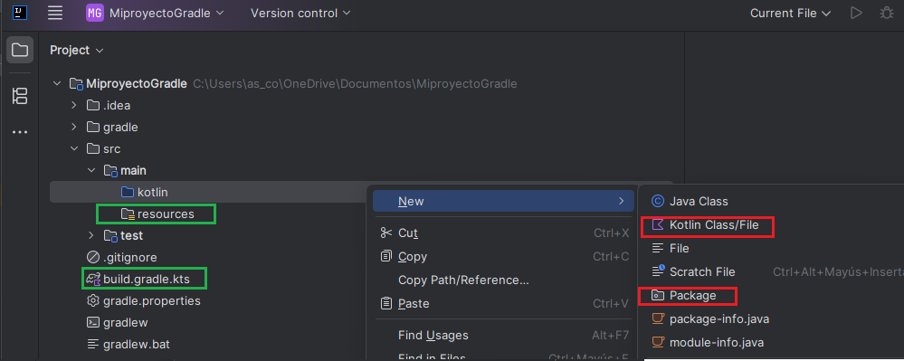|

## 🔹Estructura de los proyectos por UD

Por cada UD se crearán uno o varios proyectos con una estructura fija para facilitar su corrección.

### 🔹UD Ficheros

En esta unidad crearemos dos proyectos:

- Un proyecto **sin Gradle**, que llamaremos **Ficheros**, destinado a todos los ejemplos relacionados con el sistema de ficheros y el manejo de archivos. En este proyecto crearemos tres paquetes (sistema, contenido y formatos) para organizar los diferentes ejemplos.

- Un proyecto **con Gradle**, que llamaremos **Ficheros_Gradle**, en el que trabajaremos con ficheros de distintos formatos.

A lo largo del tema se irá indicando en qué carpeta debe colocarse cada ejemplo.

|Proyecto Ficheros |Proyecto Fichero_Gradle|
|----------|----------|
|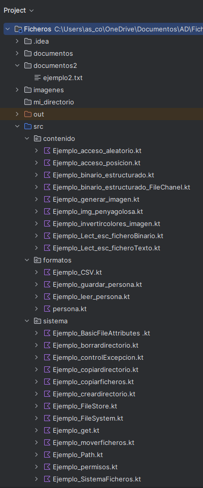|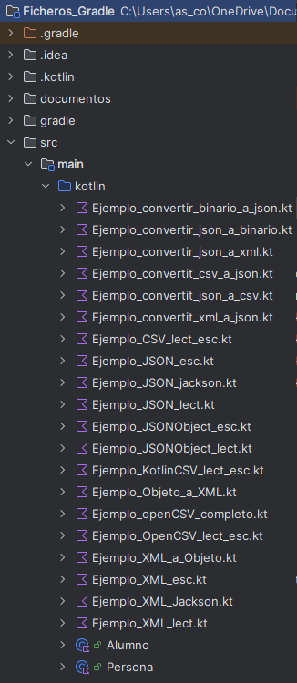|

### 🔹UD BD Relacionales

Para esta unidad didáctica, crearemos un proyecto llamado **BDRelacionales**, configurado **con Gradle**. Este proyecto se utilizará para realizar todos los ejemplos y ejercicios relacionados con el acceso a bases de datos relacionales desde Kotlin.

Con el fin de mantener una estructura organizada y diferenciada según el tipo de base de datos, se crearán dos paquetes:

- **Postgres**: donde se incluirán todos los ejemplos orientados al uso de bases de datos PostgreSQL.
- **SQLite**: donde se desarrollarán los ejemplos utilizando bases de datos SQLite, tanto embebidas como externas.

En cada apartado se especificará en qué paquete debe desarrollarse cada ejercicio, según la base de datos utilizada.

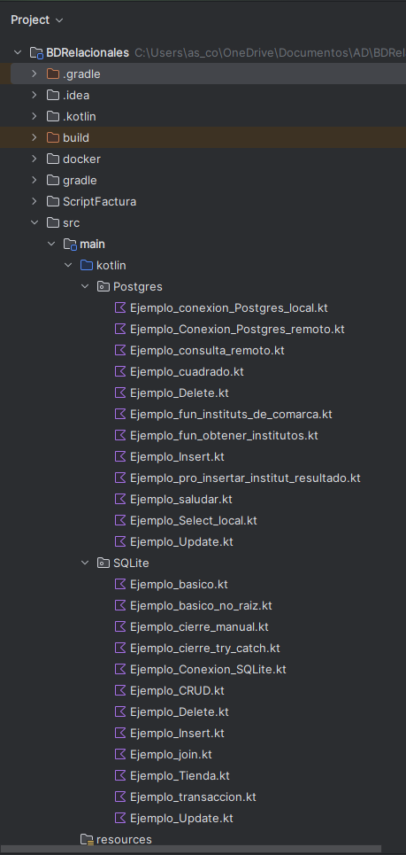

### 🔹UD BD Documentales

Para esta unidad didáctica, crearemos un proyecto llamado **BDNoSQL**, configurado **con Gradle**. Este proyecto se utilizará para realizar todos los ejemplos y ejercicios relacionados con el acceso a Bases de Datos documentales desde Kotlin.

Con el fin de mantener una estructura organizada y diferenciada según el controlador utilizado, se crearán dos paquetes:

- **mongo**: donde se incluirán los ejemplos en los que se utiliza el driver oficial de Mongo.
- **kmongo**: donde se incluirán los ejemplos en los que se utiliza el driver KMongo.

En cada apartado  se especificará en qué paquete debe desarrollarse cada ejercicio, según el controlador utilizado.

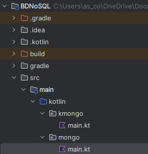

